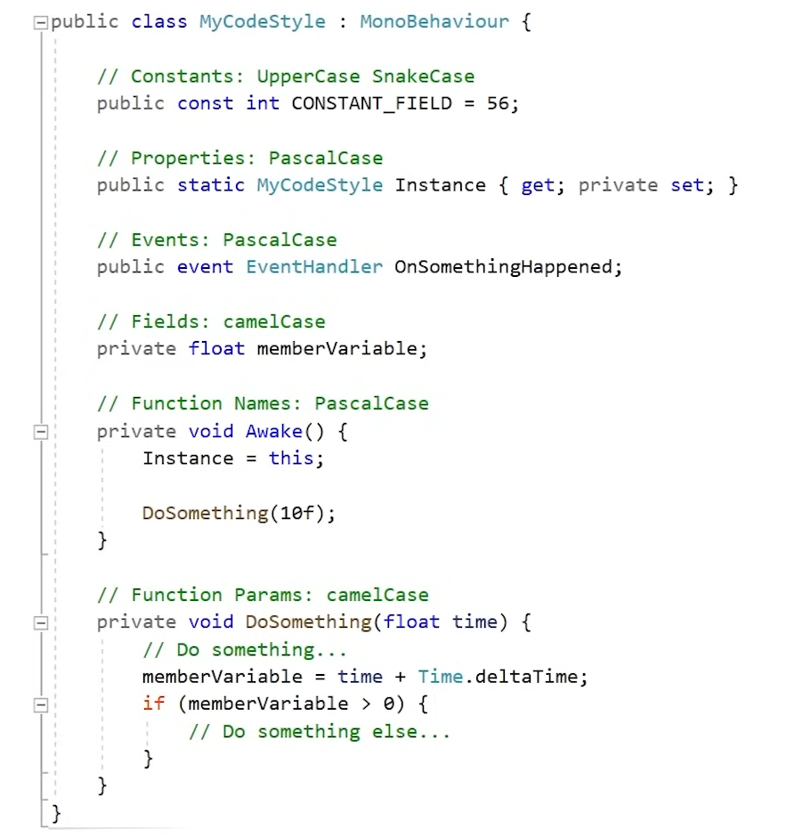

# KitchenChaos

## Development Day 1: 2024.1.1

1. 游戏项目开发时一些更为细节和谨慎地点：

   1. 代码规范：

      1. 代码编写有统一的规范，什么样的内容使用什么样的命名法：

      

      2. 代码书写应该尽可能详细：例如不要省略`private`等可以省略的关键词。

   2. 在制作角色时，一般将其视觉效果的控制和游戏角色逻辑的控制分开来，而并不是将代码直接绑定到模型上：即有一个空物体装着角色，而所有的逻辑控件放在父物体上，所有的视觉控件放在子物体上。

      

   3. 

   

   

   

   