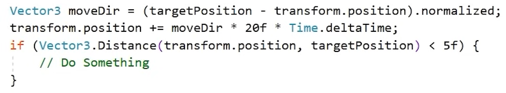
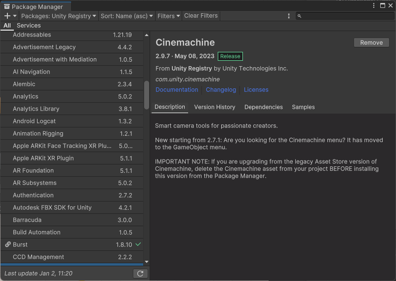
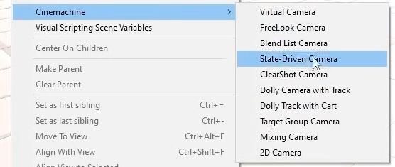
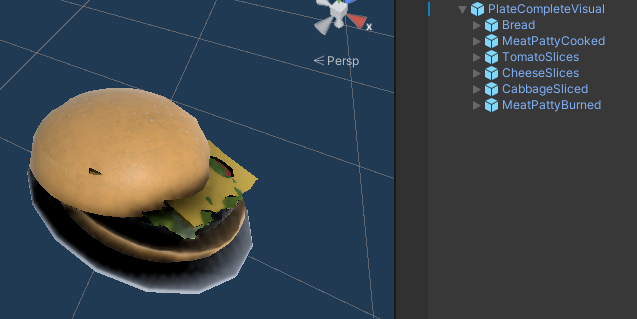
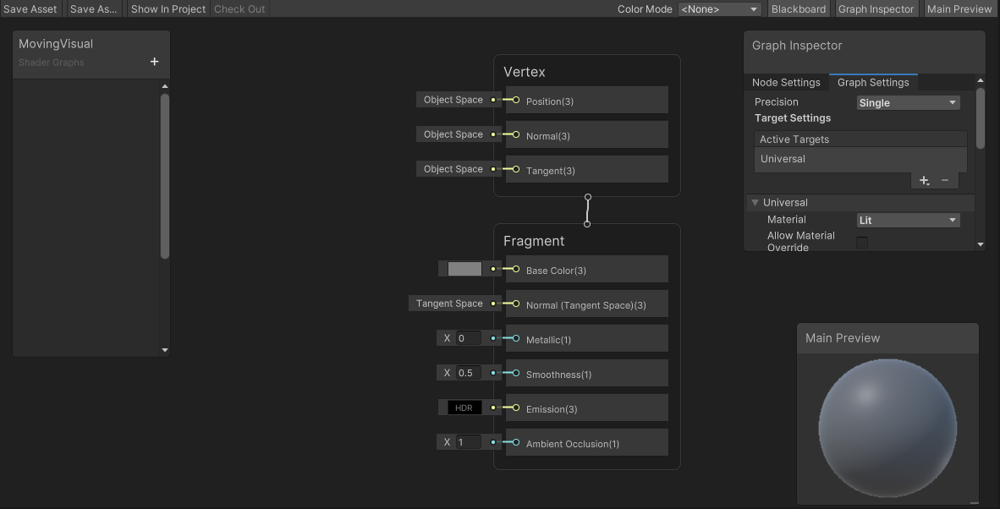
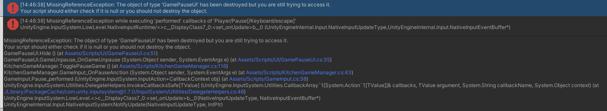

# KitchenChaos

## Development Day 1: 2024.1.1

1. 游戏项目开发时一些更为细节和谨慎地点：

   1. 代码规范：

      1. 代码编写有统一的规范，什么样的内容使用什么样的命名法：

      

      2. 代码书写应该尽可能详细：例如不要省略`private`等可以省略的关键词。

      3. 所有的字符串名称，如：动画触发变量`animator.SetBool(“IsWalking”, false);`，为了避免拼写出现问题引发不必要的问题，应该在最开始的时候将其定义为常量`private const string IS_WALKING = "IsWalking";`

      4. 在代码中尽量不要使用纯数字：下图所展示的代码中明显我们不知道`20f`和`5f`的意义，而这种情况也会发生在时隔很久再返回看某份代码的时候。

         

   2. 在制作角色时，一般将其视觉效果的控制和游戏角色逻辑的控制分开来，而并不是将代码直接绑定到模型上：即有一个空物体装着角色，而所有的逻辑控件放在父物体上，所有的视觉控件放在子物体上。

      

   ## Development Day 2: 2023.1.2

   1. `Cinemachine`：
   
      1. 首先在`Unity Package Manager`当中安装`Cinemachine`：
   
         
   
         然后既可以在`GameObject`的下拉列表中找到`Cinemachine`：
   
         
   
         `Cinemachine`是直接作用在`MainCamera`上面的一个控制器，当添加了`Cinemachine`之后，`MainCamera`将不能再被直接操作。
   
      2. 检测交互时，能不用`tag`就不用`tag`，因为`tag`的触发是通过判断字符串是否相等的，而字符串是非常脆弱非常容易出错的一种使用方式。解决办法是可以直接调用交互组件身上的代码，而不去判断是否接触到的物体是对应物体；也可以使用`layerMask`的方式，这些办法都可以规避使用字符串的场景。（当然有的时候不得不使用`tag`）。
   
   
   
   ## Development Day 3: 2024.1.3
   
   1. 代码简写：以下两段代码的功能等效
   
      ```
              if (OnInteractAction != null)
              {
                  OnInteractAction(this, EventArgs.Empty);
              }
      ```
   
      与：
   
      ```
      		OnInteractAction ? .Invoke(this, EventArgs.Empty);
      ```
   
   2. `ScriptableObject`
   
   3. `Prefab Variant`


## Development Day 4: 2024.1.4

## Development Day 5: 2024.1.5

1. 要给一个游戏物体实现获得什么就装配上的效果，其实就是把所有的组件分出好多部分来，哪一部分捡到了就将其设置为`Active`就好：

   

2. `Shift+Space`可以快捷将选中的`tab`调整为全屏。

3. `Shader Graph`：

   


## Development Day 6: 2024.1.6

1. 按键的另一种触发方式：

   ```C#
       [SerializeField] private Button playButton;
   
       private void Awake()
       {
           playButton.onClick.AddListener(PlayClick);
       }
   
       private void PlayClick()
       {
           // Button logic
       }
   ```

2. 新的`InputSystem`报错，当我从`gameScene`切换到`menu`再回到`gameScene`后尝试键盘输入时会报错，错误显示如下：究其原因是因为在场景切换时，原本挂载的`GamePauseUI`已经被销毁了，而当我再次进入场景时，依旧在去访问之前挂载的脚本的内容（而它已经不见了）。

   

   解决办法：在销毁之前将挂载的信息卸下，让下一次进入时脚本重新挂载新加载的内容：

   ```C#
       private void Awake()
       {
           Instance = this;
           playerInputActions = new PlayerInputActions();
           playerInputActions.Player.Enable();
           playerInputActions.Player.Interact.performed += Interact_performed;
           playerInputActions.Player.InteractAlternate.performed += InteractAlternate_performed;
           playerInputActions.Player.Pause.performed += Pause_performed;
       }
   
   	private void OnDestroy()
       {
           playerInputActions.Player.Interact.performed -= Interact_performed;
           playerInputActions.Player.InteractAlternate.performed -= InteractAlternate_performed;
           playerInputActions.Player.Pause.performed -= Pause_performed;
   
           playerInputActions.Dispose();
       }
   ```

   